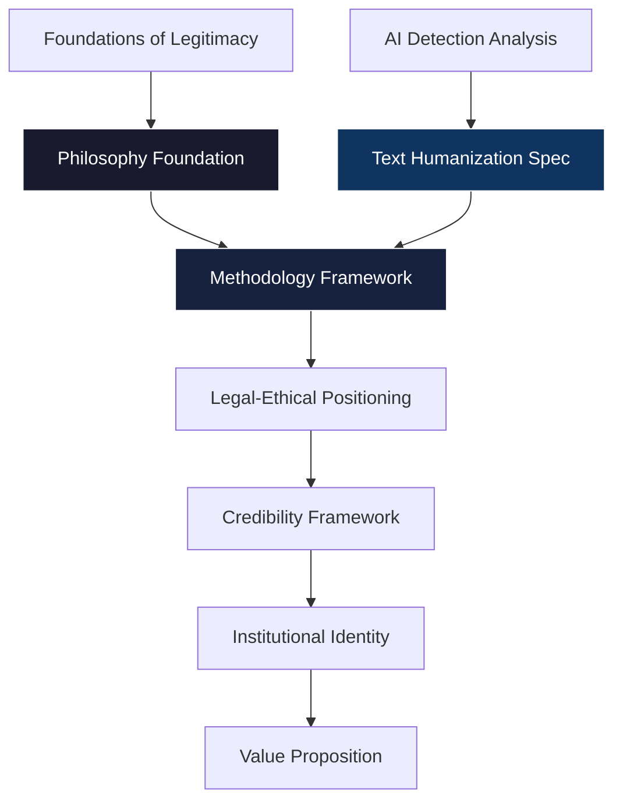

# Grossi School: Project Organization Structure

## Folder Architecture

```text
Grossi School/
├── 📁 docs/                    # Main documentation
│   ├── philosophy-foundation.md
│   ├── methodology-framework.md
│   ├── legal-ethical-positioning.md
│   ├── credibility-framework.md
│   ├── value-proposition-framework.md
│   ├── institutional-identity.md
│   └── semantic-legitimacy-standards.md
│
├── 📁 plans/                   # Strategic planning documents
│   ├── grossi-school-legitimacy-plan.md
│   └── (future project plans)
│
├── 📁 research/                 # Research and analysis documents
│   ├── foundations_of_legitimacy.md
│   ├── text-humanization-specification.md
│   └── ai-detection-analysis.md (NEW - the computational linguistic analysis)
│
├── 📁 courses/                 # Course modules
│   ├── course-catalog.md
│   └── (future course materials)
│
├── 📁 methodology/             # Methodological resources
│   ├── analytical-matrix.md
│   └── (methodology tools)
│
├── 📁 policy/                  # Institutional policies
│   ├── ai-usage-policy.md
│   ├── academic-integrity.md
│   └── (policy documents)
│
└── 📁 assets/                  # Supporting materials
    ├── templates/
    └── (reference materials)
```

## Cross-Reference Mapping

### Philosophy Layer

- [`philosophy-foundation.md`](docs/philosophy-foundation.md) → Core principles
- [`foundations_of_legitimacy.md`](research/foundations_of_legitimacy.md) → Yale case study

### Methodology Layer

- [`methodology-framework.md`](docs/methodology-framework.md) → Knowledge construction
- [`text-humanization-specification.md`](research/text-humanization-specification.md) → Humanization spec
- [`semantic-legitimacy-standards.md`](docs/semantic-legitimacy-standards.md) → Output standards

### Legal/Ethical Layer

- [`legal-ethical-positioning.md`](docs/legal-ethical-positioning.md) → Liability model
- [`credibility-framework.md`](docs/credibility-framework.md) → Validation strategy

### Identity Layer

- [`institutional-identity.md`](docs/institutional-identity.md) → Mission/Vision
- [`value-proposition-framework.md`](docs/value-proposition-framework.md) → Value proposition

---

## Logical Flow Diagram



## Integration Notes

The AI Detection Analysis document provides:

1. **Theoretical Foundation**: Mathematical basis (perplexity, burstiness)
2. **Detection Evasion**: Technical specifications for bypassing AI detectors
3. **Institutional Policy Template**: University at Buffalo case study as policy model

This directly supports:

- [`text-humanization-specification.md`](research/text-humanization-specification.md) - Provides deeper theoretical backing
- [`semantic-legitimacy-standards.md`](docs/semantic-legitimacy-standards.md) - Validates the metrics used
- Policy documents in [`policy/`](policy/) - Model for institutional frameworks

---

*Last Updated: 2026-03-25*
*Status: Organizational Structure Defined*
