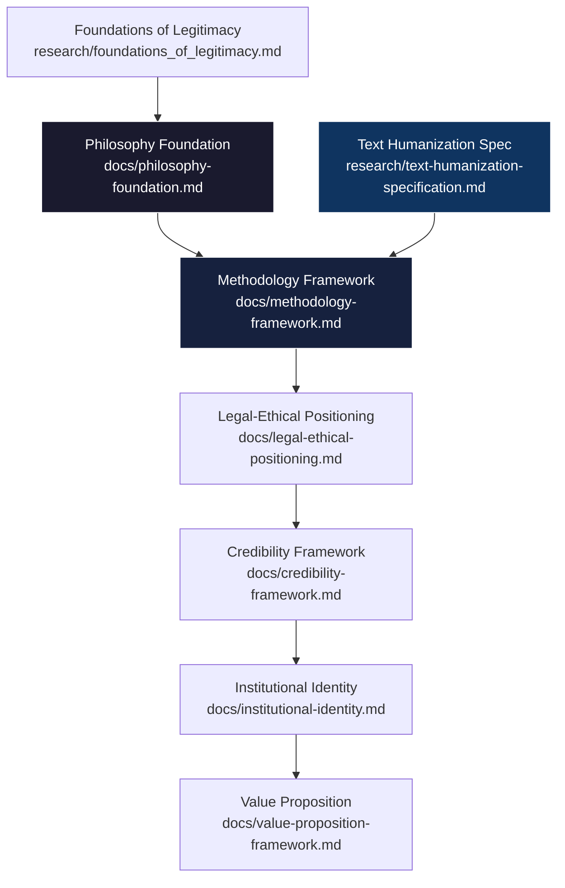

# Grossi School: Project Organization Structure

## Folder Architecture

```
Grossi School/
├── 📁 docs/                    # Main institutional documentation
│   ├── credibility-framework.md
│   ├── institutional-identity.md
│   ├── legal-ethical-positioning.md
│   ├── methodology-framework.md
│   ├── philosophy-foundation.md
│   ├── semantic-legitimacy-standards.md
│   └── value-proposition-framework.md
│
├── 📁 plans/                   # Strategic planning documents
│   └── grossi-school-legitimacy-plan.md
│
├── 📁 research/                # Research and analysis
│   ├── foundations_of_legitimacy.md    # Yale case study
│   └── text-humanization-specification.md  # Humanization spec
│
├── 📁 courses/                 # Course modules (placeholder)
│
├── 📁 methodology/             # Methodological resources (placeholder)
│
├── 📁 policy/                  # Institutional policies (placeholder)
│
├── 📁 assets/                  # Supporting materials
│   └── templates/
│
├── ARCHITECTURE.md            # This file
└── README.md                  # Project overview (if applicable)
```

## Cross-Reference Mapping

### Philosophy Layer

- [`docs/philosophy-foundation.md`](docs/philosophy-foundation.md) - Core principles
- [`research/foundations_of_legitimacy.md`](research/foundations_of_legitimacy.md) - Yale case study

### Methodology Layer

- [`docs/methodology-framework.md`](docs/methodology-framework.md) - Knowledge construction
- [`research/text-humanization-specification.md`](research/text-humanization-specification.md) - Humanization spec
- [`docs/semantic-legitimacy-standards.md`](docs/semantic-legitimacy-standards.md) - Output standards

### Legal/Ethical Layer

- [`docs/legal-ethical-positioning.md`](docs/legal-ethical-positioning.md) - Liability model
- [`docs/credibility-framework.md`](docs/credibility-framework.md) - Validation strategy

### Identity Layer

- [`docs/institutional-identity.md`](docs/institutional-identity.md) - Mission/Vision
- [`docs/value-proposition-framework.md`](docs/value-proposition-framework.md) - Value proposition

### Planning Layer

- [`plans/grossi-school-legitimacy-plan.md`](plans/grossi-school-legitimacy-plan.md) - Master project plan

---

## Logical Flow



## Integration Status

The project framework is complete with:

- **7 core documents** in `docs/` folder
- **2 research documents** in `research/` folder  
- **1 master plan** in `plans/` folder
- **1 architecture overview** (this file)
- Cross-references established between all related documents

---

*Last Updated: 2026-03-25*
*Status: ✅ Organization Complete*
